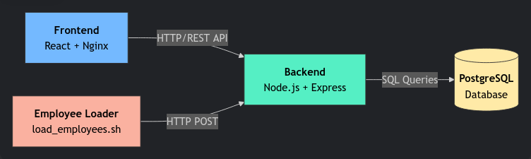

# 📦 Employee Management System

A full-stack application for managing employee data, featuring a React frontend, Node.js/Express backend, and PostgreSQL database, all containerized with Docker.

## 🌐 System Overview



## 🛠️ Technical Stack

| Component       | Technology               | Port  |
|-----------------|--------------------------|-------|
| **Frontend**    | React.js + Nginx         | 4000  |
| **Backend**     | Node.js + Express        | 3000  |
| **Database**    | PostgreSQL 16            | 5432  |

## 🚀 Getting Started

### Prerequisites

- [Docker](https://docs.docker.com/get-docker/) (v20.10+)
- [Docker Compose](https://docs.docker.com/compose/install/) (v2.0+)

### Installation & Execution

1. **Start the application:**
   ```bash
   docker-compose up -d --build
2. **Load sample data (after services are running):**
   ```bash
   ./scripts/load_employees.sh

### Project structure

```bash
.
├── backend/                  # Backend (Node.js + Express)
│   ├── database/             # Database configuration and scripts
│   │   └── init.sql          # SQL initialization script
│   ├── src/                  # Backend source code
│   │   ├── db.js             # Database connection setup
│   │   ├── index.js          # Application entry point
│   │   └── routes/           # API endpoint definitions
│   │       └── employees.js  # Employee-related routes
│   ├── Dockerfile            # Docker configuration for backend
│   └── package.json          # Backend dependencies and scripts
│
├── frontend/                 # Frontend (React + Nginx)
│   ├── public/               # Public assets
│   │   └── index.html        # Main HTML template
│   ├── src/                  # Frontend source code
│   │   ├── components/       # React components
│   │   │   ├── App.js        # Main component
│   │   │   ├── AreaSection.jsx # Area section component
│   │   │   ├── EmployeeCard.jsx # Employee card component
│   │   │   └── EmployeeDetailsModal.jsx # Details modal component
│   │   ├── services/         # API services/clients
│   │   │   └── api.js        # Backend API calls setup
│   │   ├── app.css           # Global styles
│   │   ├── index.js          # React entry point
│   │   └── reportWebVitals.js # Performance metrics
│   ├── Dockerfile            # Docker configuration for frontend
│   ├── nginx.conf            # Nginx web server configuration
│   ├── package.json          # Frontend dependencies and scripts
│   └── package-lock.json     # Exact dependency versions
│
├── scripts/                  # Utility scripts
│   └── load_employees.sh     # Initial employee data loading script
│
└── docker-compose.yml        # Docker containers orchestration
```
### 🔌 Accessing Services

| Component       | URL                      | Access Method     |
|-----------------|--------------------------|------------------ |
| **Frontend**    | http://localhost:4000    | Web browser       |
| **Backend**     | http://localhost:3000    | REST client       |
| **Database**    | localhost:5432           | PostgreSQL client |


**Example API request:**
  ```bash
  curl http://localhost:3000/employees
  ```

### 📓 Technical Notes

This document compiles comments, best practices, and important clarifications about the application and its deployment using Docker Compose.

---

#### 🔍 Structure & Services

- **Frontend**: Built with React.js and served by Nginx on port `4000`.
- **Backend**: Implemented in Node.js with Express, exposed on port `3000`.  
  Contains the business logic and connects to PostgreSQL.
- **Database**: PostgreSQL 16, automatically initialized using `init.sql`.
- **Data loading script (`load_employees.sh`)**: Facilitates inserting initial employee data into the backend via HTTP POST requests.

---

#### 💡 Clarifications

1. **Data Persistence**
   - The `postgres_data` volume ensures that database information is not lost when restarting containers.
   - If you need a clean database, remove the volume:
     ```bash
     docker-compose down -v
     ```

2. **Database Initialization**
   - The `init.sql` file runs **only the first time** the PostgreSQL container is created.
   - If you need to modify the schema later, you must do it manually or run migration scripts.

3. **Service Dependencies & Startup Order**
   - The `depends_on` directive in `docker-compose.yml` ensures:
     - The backend waits for the database to start.
     - The frontend waits for the backend to start.
   - However, this does not fully guarantee the service is ready to accept connections.  
     For production environments, a **healthcheck script** is recommended.

4. **Running `load_employees.sh`**
   - This script must be run **after all containers are up and running**.
   - If the backend is not ready yet, the script will fail.
   - It can be adapted to retry until the backend becomes available.

5. **React Optimization**
   - The `EmployeeCard` component can be optimized with `React.memo` and `PropTypes` to avoid unnecessary re-renders and improve maintainability.
   - If using TypeScript, prefer strict type definitions instead of PropTypes.

6. **Development Best Practices**
   - In development, mapping the backend and frontend source code as volumes avoids rebuilding images for every change.
   - Example for the backend in `docker-compose.override.yml`:
     ```yaml
     volumes:
       - ./backend/src:/app/src
     ```

#### 📝 Improvement Roadmap

1. **Incomplete Frontend CRUD Implementation**
   - Login page
   - Currently, the frontend only supports requested functionality.
   - The remaining CRUD operations (Create, Read, Update, Delete) need to be implemented to match the backend API capabilities.

2. **Lack of Automated Testing**
   - Due to time constraints, automated tests (unit, integration, and end-to-end) have not been implemented.
   - It is recommended to add:
     - **Unit tests** for React components and backend business logic.
     - **Integration tests** for API endpoints.
     - **E2E tests** to validate the complete user flow.

3. **Authentication & Role Management**
   - For a more complete application, user authentication and role-based access control could be added.
   - Example:
     - **Admin role**: Full CRUD permissions.
     - **Regular user**: Read-only access.
   - This would also require adapting the backend endpoints to enforce access restrictions.

---

#### ⚙️ Maintenance Commands
| Command                               | Description                   |
|---------------------------------------|-------------------------------|
| docker-compose logs -f <some_service> | View service logs             |
| docker-compose restart <some_service> | Restart services              |
| docker-compose down --volumes         | Full cleanup (including data) |